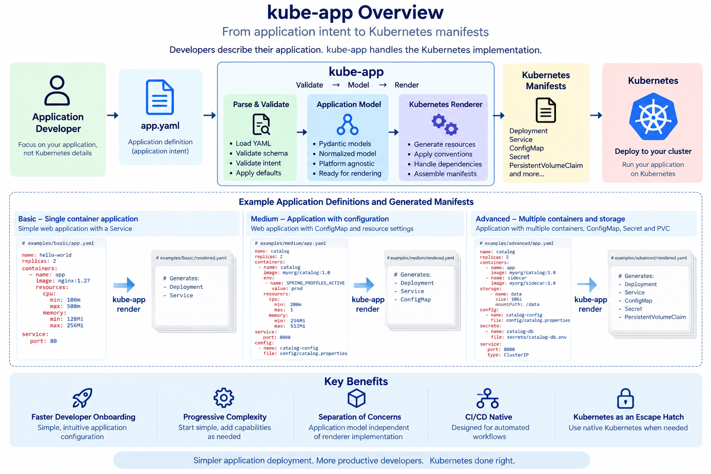
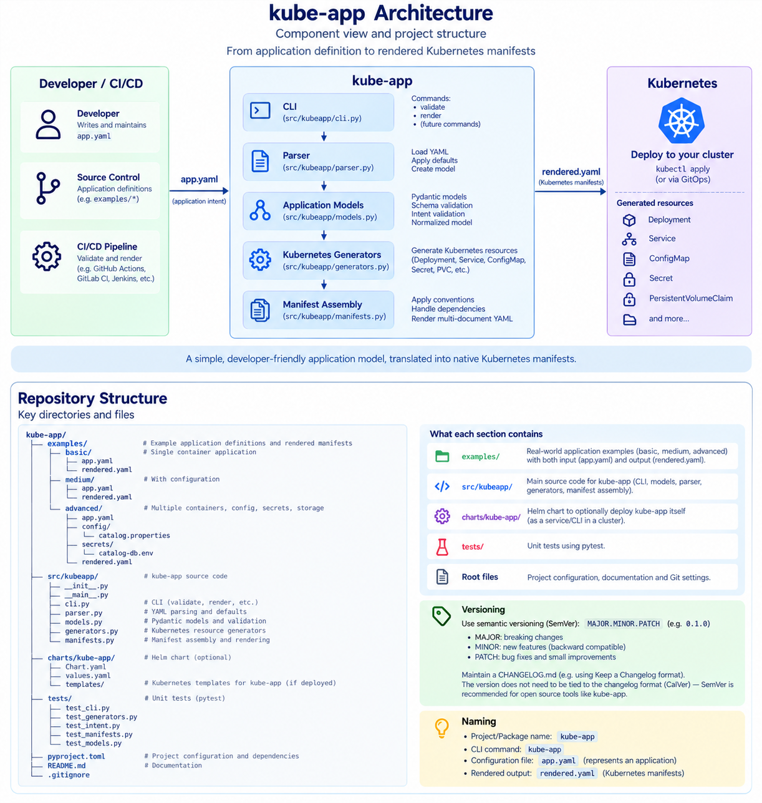

# Kube-App

> **Version:** 0.2.0 · **Release status:** Development Preview

A lightweight developer-facing abstraction for deploying standardized applications to Kubernetes without requiring application developers to manage Kubernetes primitives directly.



## Vision

Kube-App provides a simple, declarative application specification that allows developers to describe **what their application needs**, while the platform translates that intent into Kubernetes resources.

The goal is to create a consistent developer experience while allowing platform teams to own Kubernetes implementation details, platform defaults, security standards, and operational conventions.

Over time, Kube-App aims to support the same application model across Kubernetes environments such as **Amazon EKS**, **Azure AKS**, and local development clusters.

---

## Why Kube-App?

Kubernetes provides a powerful application platform, but application developers often need to understand infrastructure concepts that are not directly related to their application.

A typical deployment may require developers to work with:

* Deployments
* Services
* ConfigMaps
* Secrets
* PersistentVolumeClaims
* ServiceAccounts
* labels and selectors
* volumes and volume mounts
* container resource requests and limits

Kube-App introduces an application-oriented layer above these primitives.

Instead of describing Kubernetes resources directly, developers describe application intent:

```yaml
name: hello-world

replicas: 2

containers:
  - name: hello-world
    image: nginxinc/nginx-unprivileged:1.27
    imagePullPolicy: IfNotPresent
    ports:
      - name: http
        port: 8080

    resources:
      cpu:
        min: 100m
        max: 500m
      memory:
        min: 128Mi
        max: 256Mi

service:
  port: 80
  targetPort: http
```

Kube-App validates the application definition, applies platform defaults, and renders the required Kubernetes manifests.

The objective is **not** to hide Kubernetes completely. Kubernetes remains the escape hatch for requirements that do not belong in the platform's paved road.

---

## Core Concept

The public YAML describes **application intent**, not Kubernetes implementation details.

```text
app.yaml
   │
   ▼
Application Model
   │
   ▼
Validation + Defaults
   │
   ▼
KubernetesRenderer or HelmRenderer + helm template
   │
   ▼
Kubernetes Manifests
   │
   ▼
Kubernetes
```

The application model remains independent of the rendering implementation.

This allows Kube-App to evolve its Kubernetes implementation without requiring application developers to rewrite their application definitions.

For architectural details, see:

* [Architecture](docs/ARCHITECTURE.md)
* [Rendering semantics](docs/RENDERING.md)

---

# Quick Start

## Requirements

Development currently requires:

* Python 3.11 or later
* pip
* Helm installed and available on `PATH` only when using the Helm renderer

A Kubernetes cluster is **not required** to validate applications or render manifests.

## Install for development

From the repository root:

```sh
python -m pip install -e .
```

This installs the `kube-app` command.

## Validate an application

```sh
kube-app validate examples/basic/app.yaml
```

## Render Kubernetes manifests

Both renderers produce final Kubernetes YAML. Kubernetes is the default; select
a backend with `--renderer` or `-r`. Aliases normalize internally to `kubernetes`
or `helm`:

| Renderer | Accepted values |
| --- | --- |
| Kubernetes (default) | `kubernetes`, `k8s`, `k` |
| Helm | `helm`, `h` |

Write manifests to standard output:

```sh
kube-app render examples/basic/app.yaml
kube-app render examples/basic/app.yaml --renderer kubernetes
kube-app render examples/basic/app.yaml -r k8s
kube-app render examples/basic/app.yaml --renderer helm
kube-app render examples/basic/app.yaml -r h
```

Use `-o` / `--output` with either renderer to write manifests to a file:

```sh
kube-app render examples/basic/app.yaml \
  -o examples/basic/rendered.yaml
```

The same commands can also be invoked through Python:

```sh
python -m kubeapp validate examples/basic/app.yaml
python -m kubeapp render examples/basic/app.yaml
```

---

# Application Model

Kube-App uses **one application schema**.

Basic, medium, and advanced applications are progressively richer uses of the same model.
All three examples work unchanged with either renderer; renderer selection is a CLI option,
not part of the application YAML.

## Basic

A basic application can define:

* application name
* replicas
* containers
* images
* resources
* service

Example:

```yaml
name: hello-world

replicas: 2

containers:
  - name: hello-world
    image: nginxinc/nginx-unprivileged:1.27
    imagePullPolicy: IfNotPresent
    ports:
      - name: http
        port: 8080

    resources:
      cpu:
        min: 100m
        max: 500m
      memory:
        min: 128Mi
        max: 256Mi

service:
  port: 80
  targetPort: http
```

See [`examples/basic`](examples/basic/).

## Medium

A medium application builds on the same model with common runtime requirements such as:

* environment variables
* configuration
* secrets
* persistent storage
* mounts
* service options

See [`examples/medium`](examples/medium/).

## Advanced

An advanced application can additionally demonstrate capabilities such as:

* multiple containers
* init containers
* service accounts
* file-based configuration
* file-based secrets
* shared storage

See [`examples/advanced`](examples/advanced/).

For complete examples and regeneration instructions, see the [examples guide](examples/README.md).

---

# Resource Declaration and Consumption

Kube-App separates **resources that exist** from **how application components consume them**.

Top-level resources define what exists.

For example:

```yaml
storage:
  name: data
  size: 10Gi
  storageClass: fast
  accessModes:
    - ReadWriteOnce
```

A container can then consume that storage:

```yaml
containers:
  - name: catalog
    image: registry.example.com/catalog:1.4.2

    mounts:
      - storage: data
        path: /data
```

The same principle applies to configuration and secrets.

This keeps resource ownership separate from container-specific consumption.

---

# Configuration and Secrets

Configuration and secrets can be defined from inline data or files.

Example configuration:

```yaml
configuration:
  - name: catalog-config
    data:
      APP_ENV: production
      LOG_LEVEL: info
```

File-based configuration:

```yaml
configuration:
  - name: catalog-config
    file: config/catalog.properties
```

Secrets can follow the same pattern:

```yaml
secrets:
  - name: catalog-db
    file: secrets/catalog-db.env
```

Application components determine how those resources are consumed.

For example:

```yaml
containers:
  - name: catalog
    image: registry.example.com/catalog:1.4.2

    secrets:
      - name: catalog-db
        as: environment

    mounts:
      - configuration: catalog-config
        path: /etc/catalog
```

Files are resolved relative to the application definition during rendering.

The advanced example contains demonstration credentials only.

**Never commit real credentials, secret files, or rendered manifests containing real secret values.**

See [Rendering Semantics](docs/RENDERING.md) for details about file inputs and environment substitution.

---

# Storage

Kube-App models persistent application storage without requiring application developers to construct Kubernetes PersistentVolumeClaims directly.

Example:

```yaml
storage:
  name: data
  size: 10Gi
  storageClass: fast
  accessModes:
    - ReadWriteOnce
```

Kube-App renders a Kubernetes **PersistentVolumeClaim (PVC)**.

It does **not** create PersistentVolumes directly.

When a `storageClass` is specified, Kubernetes dynamic provisioning is expected to provide the underlying PersistentVolume.

---

# Services

Applications can expose a service with a small application-level definition:

```yaml
service:
  port: 8080
```

Service options can also be specified:

```yaml
service:
  type: LoadBalancer
  port: 8080
```

When an application contains multiple containers, the service can identify the target container:

```yaml
service:
  type: LoadBalancer
  port: 8080
  container: catalog
```

Kube-App owns the Kubernetes labels, selectors, and other implementation details required to connect the Service to the workload.

---

# Generated Kubernetes Resources

Depending on the application definition, Kube-App can currently render resources including:

* Deployment
* Service
* ConfigMap
* Secret
* PersistentVolumeClaim

Additional workload behavior is generated from the application model, including:

* multiple containers
* init containers
* environment variables
* resource requests and limits
* configuration mounts
* secret mounts
* persistent storage mounts
* service account references

Rendered example manifests are committed beside their corresponding application definitions:

```text
examples/
├── basic/
│   ├── app.yaml
│   └── rendered.yaml
├── medium/
│   ├── app.yaml
│   └── rendered.yaml
└── advanced/
    ├── app.yaml
    ├── rendered.yaml
    ├── config/
    │   └── catalog.properties
    └── secrets/
        └── catalog-db.env
```

---

# Testing

The test suite uses Python's standard-library `unittest` framework.

Run the complete suite:

```sh
python -m unittest discover -s tests -v
```

The tests cover:

* application model validation
* defaults and constraints
* application intent validation
* configuration and secret references
* storage and mounts
* services
* multiple containers
* init containers
* manifest generation
* CLI behavior
* example output comparisons
* compatibility behavior

No running Kubernetes cluster is required. Install Helm on `PATH` to run the complete
suite, including chart and CLI equivalence tests; those tests are skipped without Helm.

See the [test guide](tests/README.md) for details.

---

# Current Architecture

Kube-App separates the developer-facing application contract from validation and Kubernetes rendering.



The key implementation rule is:

> **The application model must remain independent of the renderer.**

Both implemented backends consume the same validated Application model. The CLI
serializes KubernetesRenderer resources directly or passes HelmRenderer values
through the existing chart with `helm template`.

See [Architecture](docs/ARCHITECTURE.md) for the architectural source of truth.

---

# Helm Renderer

Helm is an implemented alternative rendering backend. `kube-app render -r helm`
uses the repository's `charts/kube-app` chart and `helm template` to produce final
Kubernetes YAML. It renders your application; it does not install a Helm release
or deploy kube-app itself. No cluster connection is required.

The default Kubernetes renderer and validation work without Helm. The Helm backend
requires Helm on `PATH`. Both backends resolve configuration and Secret files
relative to the application YAML and support the unchanged Basic, Medium, and
Advanced examples. Their output is tested for semantic equivalence; descriptive
Helm labels, document ordering, and equivalent Secret encoding may differ.

The Helm backend currently rejects digest image references, init container ports,
multiple ports per container, non-TCP ports, and Service types other than ClusterIP
or LoadBalancer. These limits do not change the public schema.

Check the chart with:

```sh
helm lint charts/kube-app
```

---

# Distribution

Kube-App currently runs as a Python application during development.

The intended end-user experience is a standalone CLI:

```sh
kube-app validate app.yaml
kube-app render app.yaml
```

End users should eventually **not need to install Python, Pydantic, PyYAML, or other runtime dependencies**.

Standalone packaging is intentionally deferred until the core application model and CLI stabilize.

---

# Roadmap

Kube-App is intentionally being developed incrementally.

## v0.1 — Core Application Abstraction

Implemented foundation:

* developer-facing application schema
* typed application model
* validation and defaults
* direct Kubernetes manifest rendering
* Deployment and Service generation
* configuration and secrets
* persistent storage
* multiple containers
* init containers
* service account references
* deterministic examples
* automated tests

## v0.2.0 — Alternative Rendering Backend

* Kubernetes and Helm renderer selection with aliases
* final Kubernetes YAML through either CLI path
* Basic, Medium, and Advanced semantic equivalence tests

## Platform Defaults and Security

The renderer does not inject pod or container security contexts that are absent
from `app.yaml`. The public schema currently has no security context fields.

Container-level HTTP readiness, liveness, and startup probes are configured under
`health`. Container `ports`, `imagePullPolicy`, and `command` / `args` are also
supported. See [runtime configuration](docs/RENDERING.md#runtime-configuration-v011)
for syntax, defaults, validation, and compatibility details.

Rollout strategies and disruption protection remain future work.

## Policy as Code

Kube-App may integrate with policy engines such as **Kyverno** for cluster-level governance.

The architectural boundary is:

> **Kube-App validates what an application specification means; cluster policy determines whether the resulting workload is allowed on the platform.**

## GitOps

Future integration with tools such as **Argo CD** can provide GitOps-based delivery.

Kube-App should integrate with established GitOps tooling rather than attempting to replace it.

## Networking

Future platform capabilities may explore **Cilium** and Kubernetes networking policy while keeping the developer-facing model application-oriented.

## Multi-Cloud Kubernetes

The application model should remain largely independent of the Kubernetes distribution.

Target environments may include:

* Amazon EKS
* Azure AKS
* local Kubernetes environments

Cloud-specific implementation should remain behind the platform abstraction wherever practical.

## Observability

Observability is deliberately decoupled from the core application model until the target platform stack is established.

Potential integrations may include:

* OpenTelemetry
* Prometheus
* Grafana
* Azure Monitor
* other platform-owned observability systems

The application contract should remain stable even if the underlying observability implementation changes.

---

# Architectural Principles

## 1. Developer Simplicity

Application developers should describe application requirements rather than Kubernetes implementation details.

## 2. Progressive Complexity

Simple applications should remain simple.

More advanced applications can opt into additional capabilities without requiring a separate schema or mode.

## 3. Platform-Owned Standards

Platform teams own defaults, governance, security standards, and infrastructure implementation.

## 4. Separation of Concerns

Application intent, validation, rendering, policy enforcement, GitOps, networking, and infrastructure should remain distinct concerns.

## 5. Kubernetes Native

Kube-App should work with Kubernetes and cloud-native technologies rather than unnecessarily replacing them.

## 6. Cloud Agnostic Where Practical

The developer-facing application model should not depend on whether the workload ultimately runs on EKS, AKS, or another Kubernetes distribution.

## 7. Don't Reinvent Mature Tools

Kube-App should provide the missing developer/platform abstraction while relying on established tools for capabilities they already solve well.

## 8. Kubernetes as the Escape Hatch

Kube-App should provide a useful paved road, not attempt to model every Kubernetes capability.

Requirements outside that paved road can continue to use Kubernetes directly.

---

# Repository Structure

```text
kubeApp/
├── src/
│   ├── README.md
│   └── kubeapp/
│       ├── __init__.py
│       ├── __main__.py
│       ├── cli.py
│       ├── parser.py
│       ├── models/
│       ├── manifests/
│       ├── renderers/
│       └── generators.py
│
├── examples/
│   ├── README.md
│   ├── basic/
│   ├── medium/
│   └── advanced/
│
├── tests/
│   ├── README.md
│   ├── cli_tests/
│   ├── model_tests/
│   └── manifest_tests/
│
├── docs/
│   ├── ARCHITECTURE.md
│   ├── RENDERING.md
│   └── kubeapp-overview.png
│
├── charts/
│   └── kube-app/
│
├── pyproject.toml
├── CHANGELOG.md
└── README.md
```

Directory-specific documentation:

* [Architecture](docs/ARCHITECTURE.md)
* [Rendering semantics](docs/RENDERING.md)
* [Examples](examples/README.md)
* [Source guide](src/README.md)
* [Test guide](tests/README.md)

---

# Development Principles

When considering a new kube-app capability, ask:

1. Is this an application requirement?
2. Is it common enough to belong on the paved road?
3. Can an ordinary application developer understand it?
4. Can the renderer translate it cleanly?
5. Does it keep the public YAML simpler than the Kubernetes resources it replaces?

The preferred development flow is:

```text
Application Model
       ↓
Validation
       ↓
Renderer
       ↓
Tests
       ↓
CLI
```

Changes should remain incremental and preserve separation between the application model and rendering implementation.

---

# Project Status

Kube-App is currently a **development preview**.

The `0.x` releases should be considered experimental. The public application schema may evolve as the project gains capabilities and real-world usage.

A future `1.0.0` release would indicate that the core developer-facing application contract is considered stable enough for broader compatibility expectations.

---

# Project Philosophy

Kube-App is built around a simple question:

> **Can we make Kubernetes easier for application developers while giving platform teams stronger control over standards, security, and operations?**

The objective is not to build another Helm, another GitOps engine, or another Kubernetes abstraction for its own sake.

The objective is to explore what a **developer-friendly, platform-owned Kubernetes experience** can look like while building on existing cloud-native technologies.
